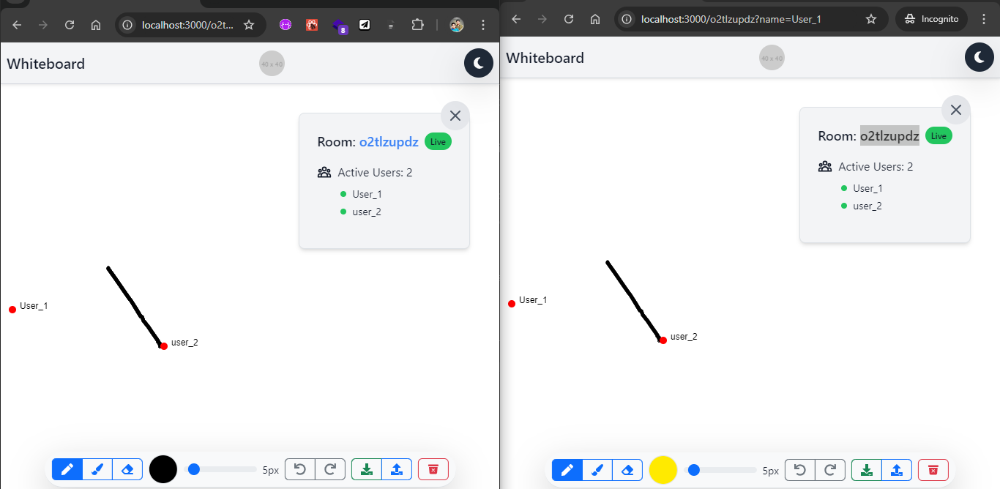

# Real-Time Collaborative Whiteboard

## Overview

This web application is a real-time collaborative whiteboard built using **React**, **TypeScript**, and **WebSocket**. It allows users to create or join whiteboard sessions, draw with various tools, and collaborate with others in real-time.

## Features

- **Whiteboard Sessions**: Users can create a new whiteboard session or join an existing one.
- **Drawing Tools**: Supports drawing with different colors and brush sizes.
- **Undo/Redo**: Users can undo or redo the last action on the whiteboard.
- **Real-Time Collaboration**: See the cursors of other users in real-time, indicating their drawing actions.
- **Save Functionality**: Option to save the whiteboard content as an image.
- **Responsive Design**: Works seamlessly on both desktop and mobile devices.

## Technologies Used

- **React**: For front-end development.
- **TypeScript**: Ensures type safety throughout the project.
- **WebSocket**: For real-time functionality.
- **Bootstrap 5**: Used for a clean, fluid, and responsive UI.
- **Konva.js**: For canvas-based drawing functionality.

## Getting Started

1. Clone the repository:

   ```bash
   git clone https://github.com/Nikhil-gna/collaborative-whiteboard.git

   cd collaborative-whiteboard
   ```

2. Install the dependencies & packages:

   ```
   npm install
   ```

3. First, run the client (PORT:3000):

   ```bash
   npm run dev
   ```

4. Then run the development server (PORT:3001) :

   ```bash
   cd server

   node server.js
   ```

## Access the application:

Open [http://localhost:3000](http://localhost:3000) with your browser to see the result.

- On the **Home page**, you will be prompted to enter a **Username**
- Then, the screen is presented with two buttons: one to **create a room** and another to **join a room**.
- If the user selects "**Create Room**", then directly redirected to the room.


- If the user selects "**Join Room**", they are prompted for a **Room ID**.


- After entring the details it will redirect to **WhiteBoard** page
- You can draw on the whiteboard using your **mouse** or **touchpad**.


- At the top right, you can see the **Dark Mode** switcher and Room Details such as **Room ID** and **Active Users**. You can close and open the modal to use the whiteboard.


- You can also see the **ToolBar** section at the bottom of the page

.png>)
.png>)

- You can use the **Toolbar** to change the **color of the brush**.
- Change the brush **size** and clear the whiteboard.
- Use the **Undo** and **Redo** buttons to undo and redo your actions.
- Use the **Clear** button to clear the whiteboard.
- Use the **Upload** button to add an **image** and draw over it.
- Use the **Download** button to **save** the whiteboard as an **image**.

- Here is the **Dark Mode** verison


- At the top right you can see the **RoomID** code, copy and share with other users to **collaborate**.
- You can also see the **Active Users** count


- As shown in the above image you can enter **UserName** and **RoomId** to join an existing room.



- After joining the room, you can see the **cursors** of other users along with their **usernames**.

- Different users can have their own **theme**, and they can select different **colors** and **brush sizes**.


- You can close the **Room Details** Modal for more drawing space.


- You can pick any **color** you want from the **RGB color wheel**.


- You can upload an image and start drawing with different colors and brush sizes. You can also erase the image.


- After drawing with team members, you can export the drawing as an image.


- You can also clear the drawing and start fresh.


